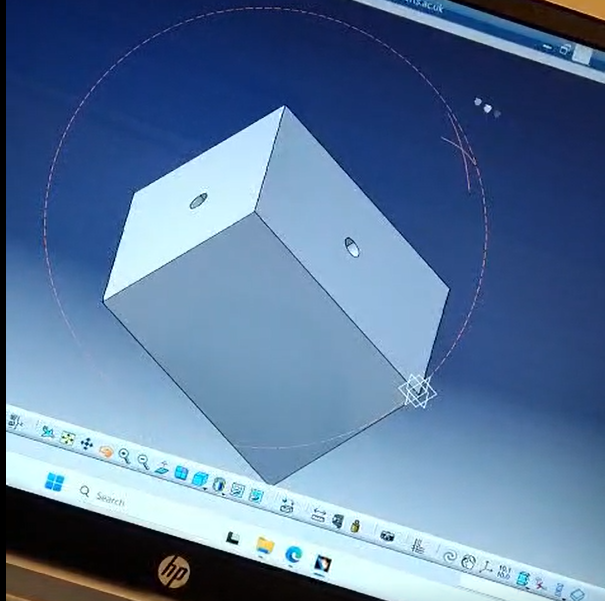
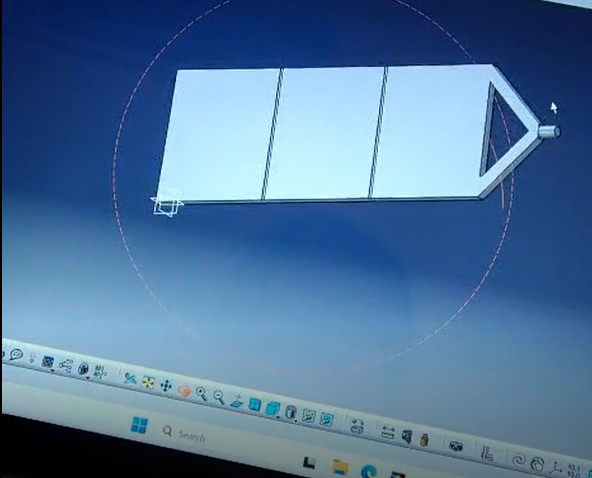
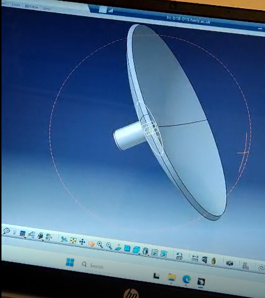

# GEO Satellite 3D Design – CATIA V5

## Project Overview

This project was completed as part of my MSc Astrophysics studies and involved the conceptual design and 3D modelling of a Geostationary Earth Orbit (GEO) satellite.

The project combined space systems engineering concepts with CAD modelling using CATIA V5.

## My Role

I developed the spacecraft configuration and created a 3D representation of the satellite using CATIA V5.

The project involved considering:

* Spacecraft configuration
* Overall spacecraft dimensions
* Propulsion requirements
* Solar-array configuration
* Power requirements
* Satellite subsystem arrangement
* Physical scale-model development

## Software

* CATIA V5
* Microsoft Excel

## CATIA V5 Work

My CATIA work included:

* 3D spacecraft modelling
* Part modelling
* Assembly modelling
* Sketch development
* Dimensional and geometric constraints
* Component configuration
* 3D visualisation

## Project Development

The project followed a process of:

**Engineering Requirements → Spacecraft Configuration → CAD Modelling → Design Development → Physical Model**

## Physical Model

A 1/30-scale physical model of the spacecraft was also developed as part of the project.

## Skills Developed

* CATIA V5 3D modelling
* Spacecraft design
* Engineering problem solving
* Technical analysis
* Design interpretation
* Technical documentation
* Attention to detail

## Career Interest

I am currently developing my CATIA V5 and mechanical design skills and am interested in graduate and junior opportunities in:

* Aerospace CAD
* Spacecraft Design
* Mechanical Design
* CAD Engineering
* Aerospace Engineering

  ## CATIA V5 Satellite Design

### Satellite Body
3D CAD model of the main satellite body developed using CATIA V5.

### Satellite Wings
CAD model of the satellite wing/solar-panel structure.

### Satellite Dish
CATIA V5 modelling of the spacecraft antenna/dish component as part of the communication system configuration..

## Portfolio

Additional images and project material are included in this repository.
